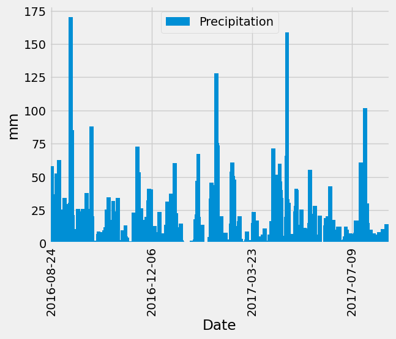
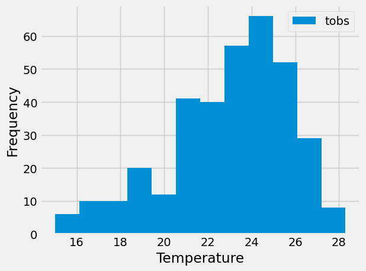

# sqlalchemy-challenge

This assignment requires students to analyse climate data from weather stations in Hawaii, performing preliminary queries and plots in Jupyter Notebooks, and creating a local web app with Flask.

---

## Aims

### 1. Analyse and Explore Climate Data

Use SQLAlchemy ORM queries, Pandas, and Matplotlib to do a basic climate analysis and data exploration of an sqlite climate database.

### 2. Design Your Climate App

Design a Flask API based on the queries developed above.

---

## Results

### 1. Analyse and Explore Climate Data

1. Plot of Precipitation (mm) by Date

2. Histogram of last 12 months of Temperature Observations

### 2. Design Your Climate App

Running `app.py` starts a local server on `http://127.0.0.1:5000/` and returns the following end points:

>`Available Routes:`

>`/api/v1.0/precipitation`

>`/api/v1.0/stations`

>`/api/v1.0/tobs`

>`/api/v1.0//`

Pasting any end-point to the base URL returns a query result, structured as a .json string.

For example, `http://127.0.0.1:5000/api/v1.0/2014-08-31` returns

>`[`

>`  {`

>`    "avg": 23.373510882016063,`

>`    "max": 30.6,`

>`    "min": 13.3`

>`  }`

>`]`

Where 2014-08-31 is the date range start, and date range end defaults to the most recent date. 